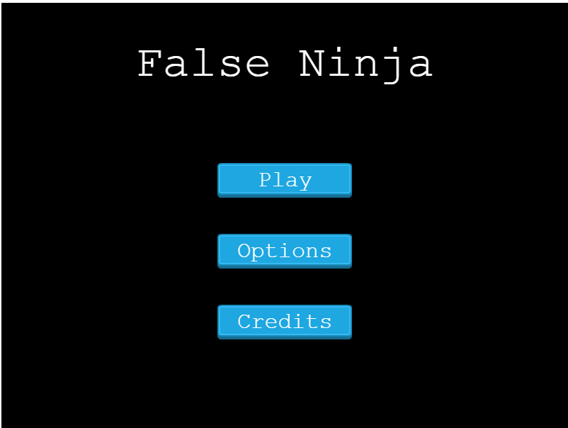
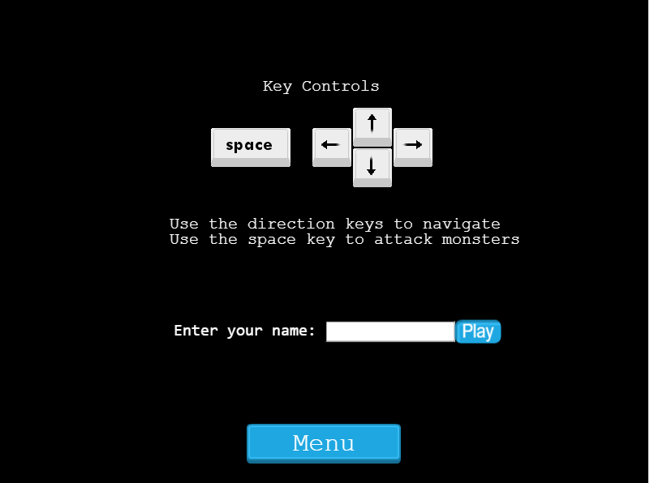
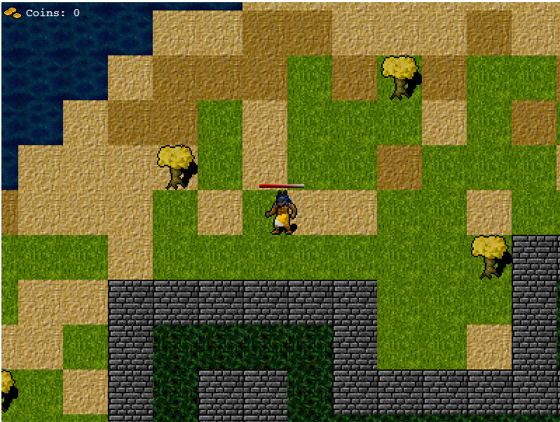

# Project Name

  <h3 align="center">JavaScript / Capstone --> [False Ninja]</h3>





<!-- ABOUT THE PROJECT -->
## About The Project

This is a Capstone project that signals the completion of the JavaScript module in the Microverse Curriculum.
It is an RPG game, specifically a platform game. The main inspiration was from multiplayer online games.
In this particular game the action is mainly focused on collecting as many chests as possible while having to combat monsters.

## Built With

* JavaScript
* Phaser3
* Webpack
* Jest

### How to Play

The game can be played using the arrow keys for moving the player and the spacebar for attacking the monster.
By moving the player you will be able to collect chests that contain gold. Each chest will update the score with a random amount between 20 and 30 golds.
Each character has a health bar, player included. The monster's health bar will decrease each time the player attacks, but watch out, the monsters have a random movement and each time you will attack they will fight back making your health bar decrease.
As a bonus though, for each monster killed the player will have back some gold and some life to increase his health bar.

### Design Process

False Ninja was designed on an initial, quite complex, webpack configuration specific for Phaser3. This allowed me to investigate Phaser and its tools from a specific perspective. The entire map was built with Tiled on a 32 x 32 collection of squares. The map then has been exported as a json file and used for placing chests, and monsters at random positions.

The player has a set velocity and can move across the map by using the arrow keys. Each time the player dies it will be spawned at a different random position to make the game more interesting. The monsters and the chests will be as well randomly generated and spawned on the map. Each spawned element has a random unique id used to interact with the user. The unique id is generated with the help of uuid npm package.

## Live Demo

[Live Demo Link](https://livedemo.com)

## Getting Started

To get a local copy up and running follow these simple example steps.

### Prerequisites

* [Node.js](https://nodejs.org/) is required to install dependencies and run scripts via npm.
* A modern browser

### Clone

* [download](https://github.com/Davidosky007/Rpg-game/archive/refs/heads/feature-1.zip) or clone this repo:
  * Clone with SSH:

  ```
    git@github.com:Davidosky007/Rpg-game.git
  ```

  * Clone with HTTPS

  ```
    https://github.com/Davidosky007/Rpg-game.git

### Setup

Install dependencies:

```
npm install
```

### Usage

Start the local webserver:

```$ npm start``` > will open a local webserver at <http://localhost:8081/> directly in your default browser with the game ready to be played

### Run tests

* Run the command and see the output:
```$ npm run test``


## Potential future features

* Extend the game to a multiplayer online game
* Add authentication process


## Author

👤 **David Bassey**

* GitHub: [@davidosky007](https://github.com/davidosky007)
* Twitter: [@davidosky2](https://twitter.com/Davidosky2)
* LinkedIn: [David Bassey](https://www.linkedin.com/in/david-bassey-akan/)

## :handshake: Contributing

Contributions, issues and feature requests are welcome!

Feel free to check the [issues page](https://github.com/Davidosky007/Rpg-game/issues).

## Show your support

Give a :star: if you like this project!

## Acknowledgments

* [OpenGameArt](https://opengameart.org/)
* [Phaser3](https://phaser.io/phaser3) & [Phaser Template](https://github.com/photonstorm/phaser3-project-template)
* [Microverse](https://www.microverse.org/)

## 📝 License

This project is [MIT](lic.url) licensed.
